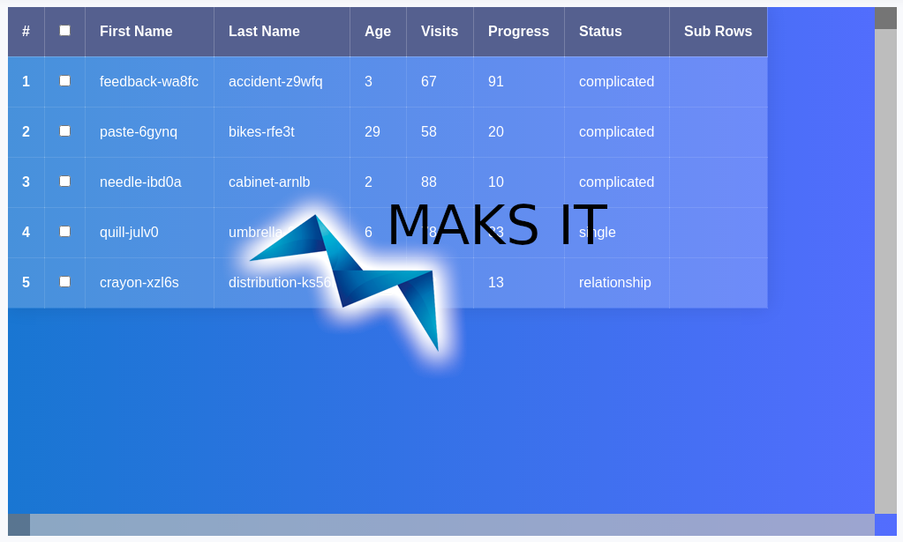

# Complex/Slice Grid (CSGrid) - Simpliest table ever to handle huge Datasets





After evaluating most of existing solutions available for React I didn't found anythging suitable for me. Most of them are bloated or lacks some (according to me) essential functionality. My main requirements to the Datatable was:

* Use standard tables with common and simple layout without js overcoding
* Render only visible rows inside viewport
* Rows selection
* Table has only data rappresentation role. Avoid internal Add/Delete/Export and other functionalities, which greatly should and must be managed outside.
* Columns and row resizing
* Columns and rows drag & drop reordering
* Columns filtering and rows ordering
* Data selection like in excel
* Less custom hacks as possible

Back to bloated solutions... My eyes still blood crying after seeing source codes...

## Huge dataset problem

Pagination is good and works well when is necessary to rappresent a lot of data... but... Sometimes we meet situations when long list is still the best rappresentation... Personally never had any necessity, but customers are asking for, they probably knows better...

Browsers have problems with rendering of a very huge DOM elements' tree, no way, we must render data in chunks, but instead of pagination control type we need to achieve the result with scroll bars in some way.

## Scroll bars problem

Standard scroll bars are tricky to use. We are going to disable them and use custom instead. Here is another thing which I've tried to avoid... I dislike `<div>` based solutions with a lot of custom event listeners. According to me, HTML5 has a great standard control type - `<input type="range" />`. Let's use it instead!

## Basic solution

On the input we have an array of objects which we can nicelly slice by selecting start and end position with our standard range control. Now have promoted our range control to vertical scroll bar grade:

```js
items = [...] // our very long array

const [vSlicer, setVSlicer] = useState(0) 

return <div>
    <input type="range" min={0} max={items.length - 1} step={1} value={vSlicer} onChange={(e) => setVSlicer(parseInt(e.target.value)))} />

    <table>
        <tbody>
            {items.slice(vSlicer, vSlicer + 20).map((row, rowIndex) => {
            return <tr key={rowIndex} tabIndex={rowIndex}>
                ...
            </tr>
            }}
        </tbody>
    </table>
</div>
```

Seems a little bit more tricky the horizontal scroll bar implementation with range control, but it's not:

```js
items = [...] // our very long array

const [hSlicer, setHSlicer] = useState(0)

return <div>
    <input type="range" min={0} max={items[0].length - 1} step={1} value={hSlicer} onChange={(e) => setHSlicer(parseInt(e.target.value)))} />

    <table>
        <tbody>
            {items.map((row, rowIndex) => {
            return <tr key={rowIndex} tabIndex={rowIndex}>
                {Object.keys(row).slice(hSlicer, hSlicer + 20).map((colName, colIndex) => {
                    <td key={colIndex} tabIndex={colIndex}>{row[collName]}</td>
                })}
            </tr>
            }}
        </tbody>
    </table>
</div>
```

All togheter:

```js
items = [...] // our very long array

const [vSlicer, setVSlicer] = useState(0) 
const [hSlicer, setHSlicer] = useState(0)

return <div className="container">
    <input type="range" className="v-slider" min={0} max={items.length - 1} step={1} value={vSlicer} onChange={(e) => setVSlicer(parseInt(e.target.value)))} />
    <input type="range" className="h-slider" min={0} max={items[0].length - 1} step={1} value={hSlicer} onChange={(e) => setHSlicer(parseInt(e.target.value)))} />

    <table>
        <tbody>
            {items.slice(vSlicer, vSlicer + 20).map((row, rowIndex) => {
            return <tr key={rowIndex} tabIndex={rowIndex}>
                {Object.keys(row).slice(hSlicer, hSlicer + 20).map((colName, colIndex) => {
                    <td key={colIndex} tabIndex={colIndex}>{row[collName]}</td>
                })}
            </tr>
            }}
        </tbody>
    </table>
</div>
```

Looks nice! We now have to work a little to style our range controls to make them appear like scroll bars.
For personal colors take a look at [materialpalette.com](https://www.materialpalette.com/)

```css
html,
body {
	height: 100%;
}

body {
	margin: 0;
	background: linear-gradient(45deg, #49a09d, #5f2c82);
	font-family: sans-serif;
	font-weight: 100;
}

.container {
	position: absolute;
	top: 50%;
	left: 50%;
	transform: translate(-50%, -50%);
}

table {
	width: 800px;
	border-collapse: collapse;
	overflow: hidden;
	box-shadow: 0 0 20px rgba(0,0,0,0.1);
}

th,
td {
	padding: 15px;
	background-color: rgba(255,255,255,0.2);
	color: #fff;
}

th {
	text-align: left;
}

thead {
	th {
		background-color: #55608f;
	}
}

tbody {
	tr {
		&:hover {
			background-color: rgba(255,255,255,0.3);
		}
	}
	td {
		position: relative;
		&:hover {
            background-color: rgba(255,255,255,0.2);
            /*
			&:before {
				content: "";
				position: absolute;
				left: 0;
				right: 0;
				top: -9999px;
				bottom: -9999px;
				background-color: rgba(255,255,255,0.2);
				z-index: -1;
            }
            */
		}
	}
}
```

## Rows and Columns Resizing

Yeah another challange. Normally table has automatic cell size set behavior. To override this and alow collapse and resizing we have to wrap cell content inside resizable `<div>`

Inside this `<div>` we have to place another two `<div>`'s, which becomes our row and col resizers.

```
______________________
|                  | |
|                  | |
|__________________|_|
|__________________|_|
```

Resulting table structure:

```xml
<div className="container">
├── <input type="range" /> // <VScrollBar />
├── <input type="range" /> // <HScrollBar />
├── <table> // <Table />
│   ├── <thead> // <Head />
│   │   └── <tr> // <TableRow //>
│   │       └── <th> // <HeadCell />
│   │           └── <div className="sizeBox"> // <SizeBox />
│   │               ├── {children}
│   │               ├── <div name="colResizer"> // <ColResizer />
│   │               └── <div name="rowResizer"> // <RowResizer />
│   └── <tbody> // <Body />
│       └── <tr> // <TableRow //>
│           └── <td>/<th> // <HeadCell />/<BodyCell />
│               └── <div className="sizeBox"> // <SizeBox />
│                   ├── {children}
│                   ├── <div name="colResizer"> // <ColResizer />
│                   └── <div name="rowResizer"> // <RowResizer />
└── <div className="contextMenu">
```


Resize logic is following: 
* Capture target object
* retreive mouseX and mouseX positions, name (this will define action we doing), and row, offsetHeight, and offsetWidth, then place them into touchState.
* On move retreive element parent and based on touchState values and mouse offest set new dimension
* Stop drag or touch event

we used onTouch events in mobile environment and onMouseDown, onMouseMove, onMouseUp for desktop binded globally to table container. Elemens are retreived inside and we perform actions based on their name


